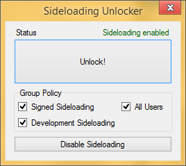

# Sideloading Unlocker

## Unlock signed sideloading on:

- Windows 8.0 and up

## Unlock full sideloading on:

- Windows 8.1 Pro and up

**Development sideloading** might take a while to activate. If it doesn't activate quick enough, you can use **Product Policy Editor** to disable **SPPSVC**, set the system clock to 2026, attempt sideloading until it activates, then revert the system clock and re-enable **SPPSVC**.

**Known bug:**

If your disk has **0 bytes** of free space, the system might fail to write the new tokens file, leaving the tokens.dat file empty and when SPPSVC starts, it will recreate the file but everything will be deactivated—including Windows itself.

MetroUnlocker always attempts to create a backup of your tokens before modifying them. Make sure you have at least **30MB** free of space before trying to activate sideloading. If something goes wrong, just restore the tokens.dat file from the backup to `C:\Windows\System32\spp\store\2.0`. In worst-case scenario, you can reactivate whatever you need activated again with **TSForge**.

Feel free to reach out to me or create an issue if you need help.

**Huge thanks to [TSForge](https://github.com/massgravel/TSforge)** for making this possible by reverse-engineering **SPPSVC**!

Thank you Zar!
